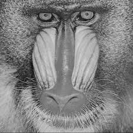
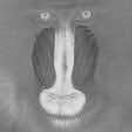
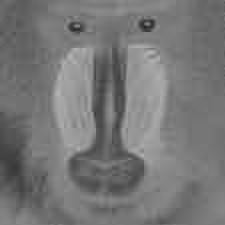
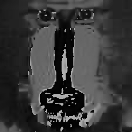
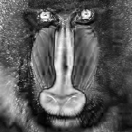
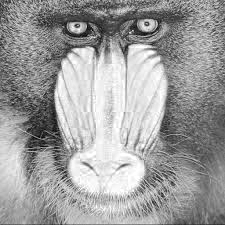

# 601openCV

## Compile & Run Instructions:
1. Run **make** for compiling all .cpp files

2. Run **./objSource** for running each file

3. Run **make clean** for removing all object files

Corresponding binaries are:

ColorImage.cpp ---> colorimg 

Noise.cpp ---> noise	

Threshold.cpp ---> threshold

## Exercise 1

Each cvMat consists of planes of pixel values for Red, Green and Blue input channels. cvMat[0] consits of all the pixels corresponding to Red channel, cvMat[1] for Green channel and cvMat[2] for Blue channel.

## Exercise 2

### Part 1
**./colorimg imageSource**: Output shows that each colorspace output: Red, Blue, Green, etc. is only a grayscale pixel value and have to be combined together if you need actual colors. 

**python ColorImage.py Test_images/baboon.jpg**

| Blue 				| Green 			  	| Red 				|
|:-----------------:|:---------------------:|:-----------------:|
|  |  	|  	|

| Y 				| Cb 			  		| Cr 				|
|:-----------------:|:---------------------:|:-----------------:|
|  		|  		|  	|

| Hue 				| Saturation 			| Value 			|
|:-----------------:|:---------------------:|:-----------------:|
|  |   |  |

### Part 2

Values for: **python ColorImage.py Test_images/baboon.jpg** 

| ColorSpace 	| (20,25) 	| min 	| max 	|
|:-------------:|:---------:|:-----:|:-----:|
| Blue 			| 102 		| 0 	| 255	|
| Green 		| 165 		| 0		| 234	|
| Red 			| 156		| 0		| 255   |
| Y 			| 155		| 1 	| 224	|
| Cb 			| 129 		| 70 	| 230	|
| Cr 			| 98 		| 35 	| 185	|
| Hue 			| 34 		| 0 	| 179	|
| Saturation 	| 97 		| 0 	| 255	|
| Value 		| 165		| 4 	| 255	|

## Exercise 3

