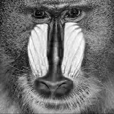
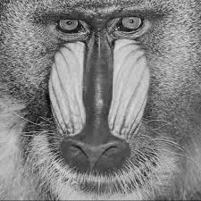
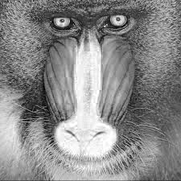

# 601openCV

## Compile & Run Instructions:
1. Run **make** for compiling all .cpp files

2. Run **./objSource** for running each file

3. Run **make clean** for removing all object files

Corresponding binaries are:

ColorImage.cpp ---> colorimg 

Noise.cpp ---> noise	

Threshold.cpp ---> threshold

## Exercise 1

Each cvMat consists of planes of pixel values for Red, Green and Blue input channels. cvMat[0] consits of all the pixels corresponding to Red channel, cvMat[1] for Green channel and cvMat[2] for Blue channel.

## Exercise 2

### Part 1
**./colorimg imageSource**: Output shows that each colorspace output: Red, Blue, Green, etc. is only a grayscale pixel value and have to be combined together if you need actual colors. 

**python ColorImage.py Test_images/baboon.jpg**

| Blue 				| Green 			  	| Red 				|
|:-----------------:|:---------------------:|:-----------------:|
|  |  	|  	|

### Part 2

Values for: **python ColorImage.py Test_images/baboon.jpg** 

Blue(20,25):  102

Blue min:  0

Blue max:  255

Green(20,25):  165

Green min:  0

Green max:  234

Red(20,25):  156

Red min:  0

Red max:  255

Y(20,25):  155

Y min:  1

Y max:  224

Cb(20,25):  129

Cb min:  70

Cb max:  230

Cr(20,25):  98

Cr min:  35

Cr max:  185

Hue(20,25):  34

Hue min:  0

Hue max:  179

Saturation(20,25):  97

Saturation min:  0

Saturation max:  255

Value(20,25):  165

Value min:  4

Value max:  255

